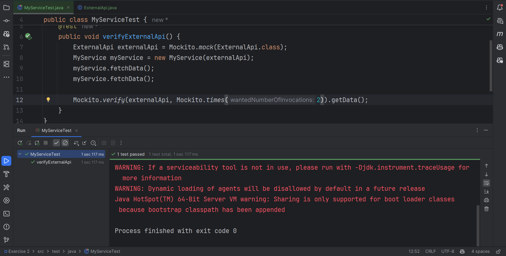

Exercise 2: Verifying Interactions
Scenario:

You need to ensure that a method is called with specific arguments.

Steps:
1. Create a mock object.
2. Call the method with specific arguments.
3. Verify the interaction. 

