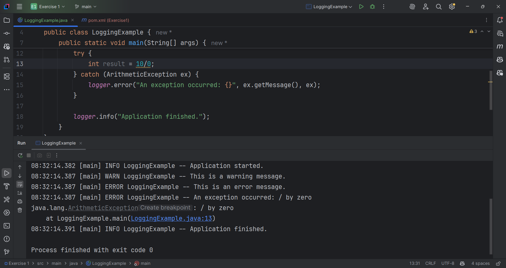

Exercise 1: Logging Error Messages and Warning Levels
Task: Write a Java application that demonstrates logging error messages and warning levels
using SLF4J.

Step-by-Step Solution:

1. Add SLF4J and Logback dependencies to your `pom.xml`
2. Create a Java class that uses SLF4J for logging

