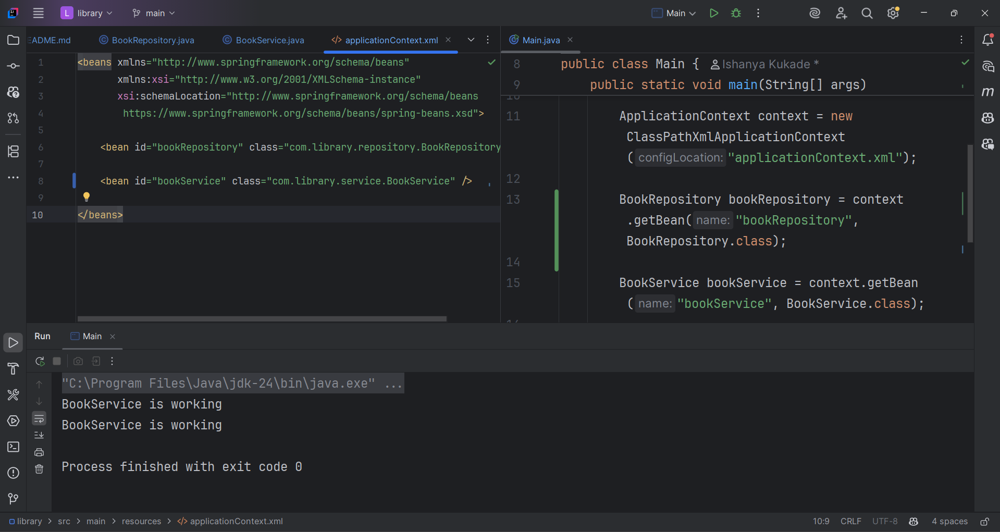

Exercise 1: Configuring a Basic Spring Application
Scenario:
Your company is developing a web application for managing a library. You need to use the Spring Framework to handle the backend operations.
Steps:
1.	Set Up a Spring Project:
      o	Create a Maven project named LibraryManagement.
      o	Add Spring Core dependencies in the pom.xml file.
2.	Configure the Application Context:
      o	Create an XML configuration file named applicationContext.xml in the src/main/resources directory.
      o	Define beans for BookService and BookRepository in the XML file.
3.	Define Service and Repository Classes:
      o	Create a package com.library.service and add a class BookService.
      o	Create a package com.library.repository and add a class BookRepository.
4.	Run the Application:
      o	Create a main class to load the Spring context and test the configuration.

