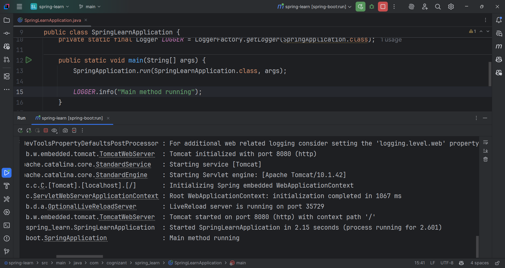

Hands on 1

Create a Spring Web Project using Maven

Follow steps below to create a project:

1.	Go to https://start.spring.io/
2.	Change Group as “com.cognizant”
3.	Change Artifact Id as “spring-learn”
4.	Select Spring Boot DevTools and Spring Web
5.	Create and download the project as zip
6.	Extract the zip in root folder to Eclipse Workspace
7.	Build the project using ‘mvn clean package -Dhttp.proxyHost=proxy.cognizant.com -Dhttp.proxyPort=6050 -Dhttps.proxyHost=proxy.cognizant.com -Dhttps.proxyPort=6050 -Dhttp.proxyUser=123456’ command in command line
8.	Import the project in Eclipse "File > Import > Maven > Existing Maven Projects > Click Browse and select extracted folder > Finish"
9.	Include logs to verify if main() method of SpringLearnApplication.
10.	Run the SpringLearnApplication class.

SME to walk through the following aspects related to the project created:
1.	src/main/java - Folder with application code
2.	src/main/resources - Folder for application configuration
3.	src/test/java - Folder with code for testing the application
4.	SpringLearnApplication.java - Walkthrough the main() method.
5.	Purpose of @SpringBootApplication annotation
6.	pom.xml
1.	Walkthrough all the configuration defined in XML file
2.	Open 'Dependency Hierarchy' and show the dependency tree.
