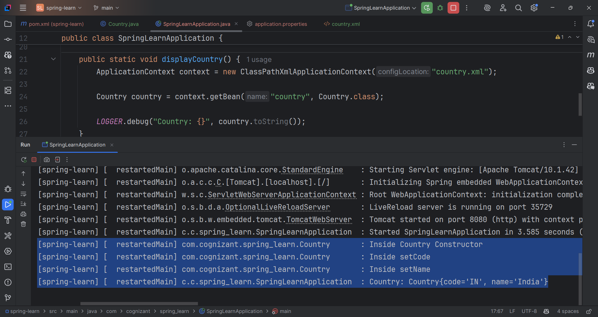

Hands on 4

Spring Core – Load Country from Spring Configuration XML

An airlines website is going to support booking on four countries. There will be a drop down on the home page of this website to select the respective country. It is also important to store the two-character ISO code of each country.

Code	Name
US	United States
DE	Germany
IN	India
JP	Japan

Above data has to be stored in spring configuration file. Write a program to read this configuration file and display the details.

Steps to implement

•	Pick any one of your choice country to configure in Spring XML configuration named country.xml.

•	Create a bean tag in spring configuration for country and set the property and values

    <bean id="country" class="com.cognizant.springlearn.Country">
    <property name="code" value="IN" />
    <property name="name" value="India" />
    </bean>

•	Create Country class with following aspects:

o	Instance variables for code and name

o	Implement empty parameter constructor with inclusion of debug log within the constructor with log message as “Inside Country Constructor.”

o	Generate getters and setters with inclusion of debug with relevant message within each setter and getter method.

o	Generate toString() method

•	Create a method displayCountry() in SpringLearnApplication.java, which will read the country bean from spring configuration file and display the country details. ClassPathXmlApplicationContext, ApplicationContext and context.getBean(“beanId”, Country.class). Refer sample code for displayCountry() method below.

    ApplicationContext context = new ClassPathXmlApplicationContext("country.xml");
    Country country = (Country) context.getBean("country", Country.class);
    LOGGER.debug("Country : {}", country.toString());

•	Invoke displayCountry() method in main() method of SpringLearnApplication.java.

•	Execute main() method and check the logs to find out which constructors and methods were invoked.

SME to provide more detailing about the following aspects:

•	bean tag, id attribute, class attribute, property tag, name attribute, value attribute

•	ApplicationContext, ClassPathXmlApplicationContext

•	What exactly happens when context.getBean() is invoked
