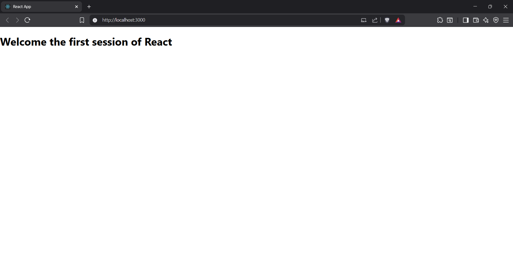

Output

Objectives

•	Define SPA and its benefits

Ans: 
- An SPA (Single-page application) is a web app implementation that loads only a single web document, and then updates the body content of that single document via JavaScript APIs such as Fetch when different content is to be shown.

- This therefore allows users to use websites without loading whole new pages from the server, which can result in performance gains and a more dynamic experience, with some tradeoff disadvantages such as SEO, more effort required to maintain state, implement navigation, and do meaningful performance monitoring.

Benefits

- Improved Speed and Responsiveness

- Smoother User Experience

- Resource Efficiency

- Mobile Friendliness and Cross-Platform Consistency

- Development Convenience

- Easier Feature-Rich Interactions

- Better Caching

•	Define React and identify its working

Ans:

- Free and open-source JavaScript library designed for building user interfaces, especially for single-page applications (SPAs). 
- Developed and maintained by Meta (formerly Facebook) along with a broad community, React enables developers to create large web applications that can update and render efficiently in response to data changes without reloading the page

1. Component Architecture

- Functional Components are simple functions that receive data (props) and return what should be displayed (JSX).

- Class Components (less common today) are ES6 classes with additional features like local state and lifecycle methods.

- Components are self-contained, reusable, and can be combined to build complex interfaces.

2. Virtual DOM

- Virtual DOM is an in-memory representation of the actual DOM. When a component’s state changes, React creates a new virtual DOM tree and compares it with the previous one using a process called reconciliation or diffing.

- Only the parts of the DOM that have actually changed are updated, making rendering very efficient.

3. Unidirectional Data Flow

- One-way data binding means data flows from parent to child components via props. This structure makes applications predictable and easier to debug.

4. Declarative Rendering

- Instead of manually manipulating the DOM, developers declare how the UI should look for each possible state. React takes care of updating the view whenever the data changes.

•	Identify the differences between SPA and MPA

| Aspect                  | SPA (Single Page Application)                                           | MPA (Multi Page Application)                                              |
|-------------------------|-------------------------------------------------------------------------|--------------------------------------------------------------------------|
| **Architecture**        | Loads a single HTML page and dynamically updates content using JavaScript | Navigates through multiple separate HTML pages; each is loaded from server |
| **Navigation**          | No full page reloads; updates sections dynamically                      | Full page reload for every new page or section                           |
| **Speed**               | Faster interactions after initial load; initial load may be heavier      | Slower interactions; each navigation triggers a new page load            |
| **User Experience**     | Smooth, app-like, seamless transitions and interactivity                 | Traditional web navigation with visible page loads and reloads           |
| **SEO**                 | More challenging; needs extra configuration for indexing                 | More SEO-friendly; each page can be indexed and optimized separately     |
| **Development Complexity** | Uses JS frameworks; modular, reusable components                   | Easier for simple sites; complex ones need more backend/frontend integration |
| **Security**            | More vulnerable to client-side attacks; needs careful handling           | Typically more secure; logic handled on server                           |
| **Scalability**         | Can be harder to scale very large apps                                   | Naturally suited for large, content-rich sites                           |
| **Offline Capabilities**| Enhanced with service workers                                            | Limited; each page load needs server access                              |
| **Back/Forward Navigation** | Needs extra code for deep linking and browser navigation          | Native browser navigation works as expected                              |
| **Best Use Cases**      | Dashboards, social networks, SaaS products, apps needing interactivity   | E-commerce, news sites, blogs, large portals                             |

•	Explain Pros & Cons of Single-Page Application

| Pros                                   | Cons                                           |
|-----------------------------------------|------------------------------------------------|
| Fast, app-like user experience          | Harder to optimize for SEO                     |
| Seamless, dynamic navigation            | Heavier initial load time                      |
| Efficient data fetching                 | More client-side security concerns             |
| Reusable code for web & mobile          | Requires extra work for navigation/history     |
| Rich, interactive features              | JS dependency; may not work with JS disabled   |
| Simplifies front-end/back-end separation| More complex analytics/tracking needs          |

•	Explain about React

Ans:

- free, open-source JavaScript library for building user interfaces (UIs), particularly for web and native applications. Developed and maintained by Meta (formerly Facebook) and a large developer community, React allows developers to build dynamic, interactive, and scalable interfaces efficiently

•	Define virtual DOM

Ans:

- The virtual DOM (VDOM) is a programming concept used in JavaScript frameworks like React to improve efficiency in updating user interfaces. It is a lightweight, in-memory representation of the real DOM—essentially a copy of the current UI preserved as JavaScript objects, rather than directly tied to the rendered page

•	Explain Features of React

Ans: 

- Component-Based Architecture
- Declarative UI
- Virtual DOM
- JSX (JavaScript XML)
- Unidirectional Data Flow
- State Management
- Lifecycle Methods (Hooks)
- React Native Support
- Extensive Ecosystem

In this hands-on lab, you will learn how to:

•	Set up a react environment

•	Use create-react-app 

Prerequisites

The following is required to complete this hands-on lab:

•	Node.js

•	NPM

•	Visual Studio Code

Notes

Estimated time to complete this lab: 30 minutes.

Create a new React Application with the name “myfirstreact”, Run the application to print “welcome to the first session of React” as heading of that page.

1.	To create a new React app, Install Nodejs and Npm from the following link:
      https://nodejs.org/en/download/
2.	Install Create-react-app by running the following command in the command prompt:
    
    npm i -g create-react-app

3.	To create a React Application with the name of “myfirstreact”, type the following command:

    npx create-react-app myfirstreact

4.	Once the App is created, navigate into the folder of myfirstreact by typing the following command:

    cd myfirstreact

5.	Open the folder of myfirstreact in Visual Studio Code
6.	Open the App.js file in Src Folder of myfirstreact
7.	Remove the current content of “App.js”
8.	Replace it with the following:

    function App() {
    return (
    <h1>Welcome the first session of React</h1>
    );
    }

9.	Run the following command to execute the React application:

    npm start

10.	Open a new browser window and type “localhost:3000” in the address bar