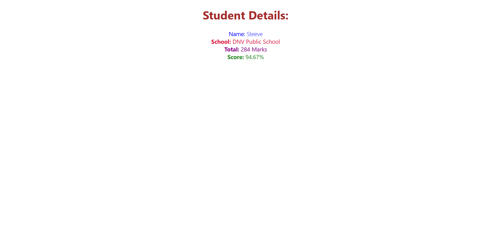

Objectives

• Explain React components

Ans:

- **React components** are the foundational building blocks of a React application. Each component is a reusable,
  self-contained piece of the user interface that manages its own structure, logic, and (optionally) state. Components
  can be combined and nested to create complex UIs, where each manages a distinct part of the overall page or app.

- Components can range from small elements like buttons to entire page layouts.
- Each component receives input data (props) and returns a React element describing what should appear on the screen.

• Identify the differences between components and JavaScript functions

Ans:

| Aspect           | React Component                              | JavaScript Function                             |
|------------------|----------------------------------------------|-------------------------------------------------|
| **Purpose**      | Renders part of a UI in React                | Performs a specific action or calculation       |
| **Return Value** | Returns React elements (JSX)                 | Returns any JavaScript value                    |
| **Integration**  | Used as `<Component />` in React trees       | Invoked as `myFunction()` in JS code            |
| **Lifecycle**    | Can have lifecycle methods (class) and hooks | No concept of lifecycle                         |
| **Props**        | Accepts `props` for control and data         | Accepts parameters, not inherently linked to UI |
| **Side Effects** | Handled with React hooks/effects             | Managed manually                                |

• Identify the types of components

Ans:

1. **Class Components**:

2. **Function Components**

• Explain class component

Ans:

- A **class component** is an ES6 JavaScript class that extends `React.Component`. It has access to additional features such as local state, lifecycle methods (e.g., `componentDidMount`), and can manage more complex component logic.

• Explain function component

Ans:

- A **function component** is a plain JavaScript function that receives `props` as an argument and returns React elements (typically JSX).

• Define component constructor

Ans:

- In a **class component**, the `constructor` is a special method used to initialize state and bind methods. It runs once when the component is created.

• Define render() function

Ans:

- The `render()` method is required in class components. It returns the JSX (or React elements) that define what appears on the screen.

In this hands-on lab, you will learn how to:
•	Create a function component
•	Apply style to components
•	Render a component
Prerequisites

The following is required to complete this hands-on lab:
•	Node.js
•	NPM
•	Visual Studio Code

Notes

Estimated time to complete this lab: 30 minutes.
Create a react app for Student Management Portal named scorecalculatorapp and create a function component named “CalculateScore” which will accept Name, School, Total and goal in order to calculate the average score of a student and display the same.

1.	Create a React project named “scorecalculatorapp” type the following command in terminal of Visual studio:

2.	Create a new folder under Src folder with the name “Components”. Add a new file named “CalculateScore.js”

3.	The following code in CalculateScore.js

4.	Create a Folder named Stylesheets and add a file named “mystyle.css” in order to add some styles to the components.

5.	Edit the App.js to invoke the CalculateScore functional component.

6.	In command Prompt, navigate into scorecalculatorapp and execute the code.

7.	Open browser and type “localhost:3000” in the address bar.