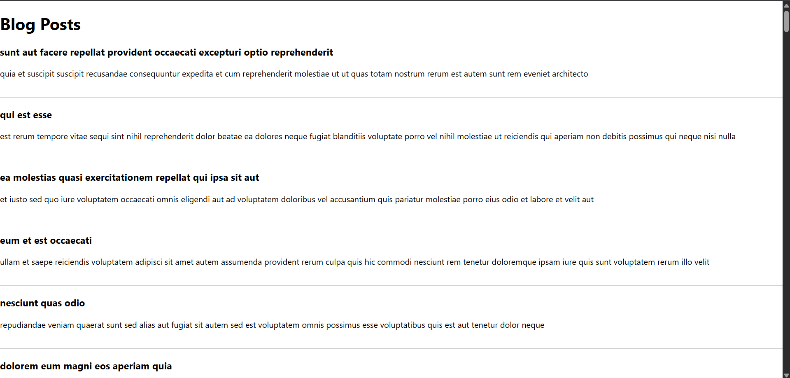

Objectives
•	Explain the need and Benefits of component life cycle

Ans: 

- React components progress through distinct phases as they are created, updated, and removed from the UI. Understanding the **component lifecycle** is essential to control and optimize behaviors during each phase, such as data fetching, resource management, and UI updates.
  
Benefits

1. Efficient Resource Management
2. Data Fetching and Persistence
3. Performance Optimization
4. Fine-Grained Control
5. Debugging Assistance
6. Consistency

•	Identify various life cycle hook methods

Ans:

- **Mounting Phase**
    - `constructor()`: Initialize state and bind methods.
    - `static getDerivedStateFromProps()`: Sync state with props before rendering.
    - `componentDidMount()`: Runs after the component is added to the DOM.

- **Updating Phase**
    - `static getDerivedStateFromProps()`: Invoked before every re-render.
    - `shouldComponentUpdate()`: Decide if a re-render is needed.
    - `render()`: Creates the component’s UI.
    - `getSnapshotBeforeUpdate()`: Capture data (like scroll position) before DOM updates.
    - `componentDidUpdate()`: Runs after DOM updates.

- **Unmounting Phase**
    - `componentWillUnmount()`: Cleanup before the component is destroyed.

•	List the sequence of steps in rendering a component

Ans:

1. **Initialization**
    - `constructor()` is called to set up initial state and bindings.
2. **Mounting**
    - `getDerivedStateFromProps()` (optional)
    - `render()`: Returns elements to display.
    - **DOM Update:** React updates the DOM with rendered output.
    - `componentDidMount()`: Invoked after the component is inserted into the DOM.
3. **Updating (when props or state change)**
    - `getDerivedStateFromProps()` (optional)
    - `shouldComponentUpdate()`: Determines if a re-render is needed.
    - `render()`: Updates element structure.
    - `getSnapshotBeforeUpdate()` (optional)
    - **DOM Update**
    - `componentDidUpdate()`: Runs after update.
4. **Unmounting**
    - `componentWillUnmount()`: Cleanup before removal from the DOM[2].

In this hands-on lab, you will learn how to:
•	Implement componentDidMount() hook
•	Implementing componentDidCatch() life cycle hook.
Prerequisites

The following is required to complete this hands-on lab:
•	Node.js
•	NPM
•	Visual Studio Code

Notes

Estimated time to complete this lab: 60 minutes.

1.	Create a new react application using create-react-app tool with the name as “blogapp”
2.	Open the application using VS Code
3.	Create a new file named as Post.js in src folder with following properties
4.	Create a new class based component named as Posts inside Posts.js file
5.	Initialize the component with a list of Post in state of the component using the constructor
6.	Create a new method in component with the name as loadPosts() which will be responsible for using Fetch API and assign it to the component state created earlier. To get the posts use the url  (https://jsonplaceholder.typicode.com/posts)
7.	Implement the componentDidMount() hook to make calls to loadPosts() which will fetch the posts.
8.	Implement the render() which will display the title and post of posts in html page using heading and paragraphs respectively.
9.	Define a componentDidCatch() method which will be responsible for displaying any error happing in the component as alert messages.
10.	Add the Posts component to App component.
11.	Build and Run the application using npm start command.
