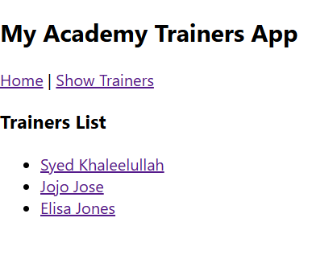

### Need and Benefits of React Router

React itself is a library for building user interfaces and does not include a routing solution out of the box. In a Single Page Application (SPA), the entire app loads once, and subsequent "page" changes happen dynamically without a full server reload.

**React Router** is a standard library for React that addresses this gap. It synchronizes the UI with the URL, allowing users to navigate through different parts of the application using familiar browser behaviors like the back button, forward button, and bookmarks.

#### Benefits:
*   **Seamless User Experience**
*   **Declarative Routing**
*   **Maintains Web Standards**
*   **Simplified and Organized Development**

---

### Components in React Router

React Router is primarily composed of a few core components that work together to create the routing system in an application.

**`<BrowserRouter>`**: This is the primary router component that should wrap your entire application. It uses the HTML5 History API to keep your UI in sync with the URL.

**`<Routes>`**: This component acts as a container for a collection of individual `<Route>` components. It intelligently picks the best `<Route>` to render based on the current URL.

**`<Route>`**: This is the most fundamental component. Its main job is to render a specific UI component (or element) when the application’s location matches the route's `path`.

**`<Link>`**: To create navigation links, you use `<Link>` instead of a standard `<a>` tag. The `<Link>` component prevents a full page reload and instead navigates the user by updating the URL internally, allowing React Router to render the appropriate new component.

---

## Types of Router Components

React Router provides different types of router components to suit various environments and needs.

1.  **`<BrowserRouter>`**: The most common router for web applications. It uses the browser's built-in History API to store routing history, resulting in clean URLs like `example.com/about`.
2.  **`<HashRouter>`**: This router uses the hash portion of the URL (the part after `#`) to manage routing (e.g., `example.com/#/about`). It's useful for older browsers or for hosting environments that don't support server-side configuration for SPAs.
3.  **`<MemoryRouter>`**: This router keeps the history of your "URL" in memory and doesn't read or write to the browser's address bar. It is primarily used for testing React applications or in non-browser environments like React Native.

---

## Parameter Passing Via URL

React Router makes it easy to pass dynamic data through the URL, which is useful for creating pages for specific items, like user profiles or product details. This is achieved through URL parameters.

### Defining a Route with Parameters

To create a route that accepts a parameter, you prefix the parameter name with a colon (`:`) in the `path` prop of the `<Route>` component.

**Example:**
    
    import { Routes, Route } from 'react-router-dom';
    import UserProfile from './UserProfile';
    
    function App() {
    return (
    <Routes>
    <Route path="/users/:userId" element={<UserProfile />} />
    </Routes>
    );
    }

In this example, `:userId` is a URL parameter. This route will match paths like `/users/123` or `/users/jane-doe`.

### Accessing URL Parameters in a Component

Within the component that the route renders (in this case, `UserProfile`), you can access the value of the URL parameter using the `useParams` hook.

**Example:**

    import { useParams } from 'react-router-dom';
    
    function UserProfile() {
    // useParams() returns an object of key/value pairs of URL parameters.
    let { userId } = useParams();
    
    return (
    

    <h1>Profile for User ID: {userId}</h1>
    {/* You can now fetch and display data for this specific user */}
    

    );
    }

If the user navigates to `/users/123`, the `useParams` hook will return `{ userId: '123' }`, and the component will display "Profile for User ID: 123".
